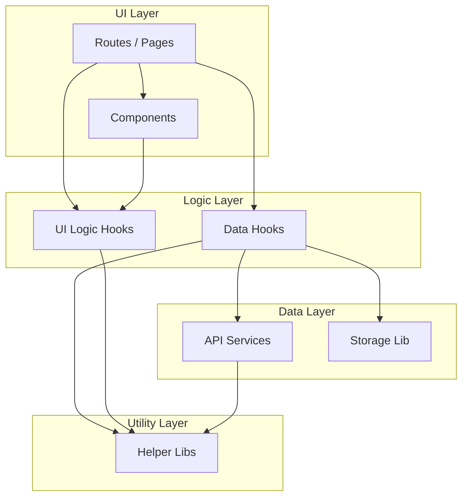

# Project Architecture

## 1. Overview
This project is a pure frontend React application designed for analyzing Polymarket traders. It uses a **Layered Architecture** to ensure separation of concerns, maintainability, and scalability. The application leverages React Hooks for business logic encapsulation and standardizes data access via API service modules.

## 2. Architectural Layers

The application is structured into four main layers:

### 2.1 UI Layer (Presentation)
- **Routes (`src/routes/`)**: Top-level page components responsible for layout and route-specific logic.
- **Components (`src/components/`)**: Reusable UI elements (Tables, Charts, Cards). These are "dumb" components that receive data via props or use custom hooks for specific behaviors.

### 2.2 Logic Layer (Business Logic)
- **Hooks (`src/hooks/`)**: Encapsulates stateful logic and side effects.
  - **Data Fetching Hooks**: `useTraderData`, `useClobMarketPrices` (manage API calls, caching, WebSocket connections).
  - **UI Logic Hooks**: `useTableData` (filtering, sorting, pagination), `useCurrentTime`.
  - **Feature Hooks**: `useCopyTradeSim` (simulation logic).

### 2.3 Data Layer (Data Access)
- **API Services (`src/lib/polymarketDataApi.ts`, `binanceApi.ts`)**: Pure functions to interact with external APIs (Polymarket Data API, Gamma API, Binance API).
- **Storage (`src/lib/storage.ts`)**: Abstraction for `localStorage` persistence.

### 2.4 Utility Layer (Infrastructure)
- **Lib (`src/lib/`)**: Stateless helper functions.
  - `analytics.ts`: Data transformation and statistical calculations.
  - `format.ts`, `validate.ts`: Formatting and validation utilities.

## 3. Module Dependency Graph



## 4. Key Design Principles

- **SOLID Principles**:
  - **Single Responsibility**: Each hook and component has a focused purpose (e.g., `useTableData` only handles table state, not data fetching).
  - **Dependency Inversion**: UI components depend on abstract hooks rather than concrete implementation details.
  
- **Custom Hooks Pattern**:
  - All complex logic is extracted into custom hooks (e.g., `useClobMarketPrices` for WebSocket logic).
  - This promotes code reuse and makes testing easier.

- **Separation of Concerns**:
  - **View**: React TSX files only handle rendering.
  - **Logic**: Custom hooks handle state and effects.
  - **Data**: API functions handle network requests.

## 5. Directory Structure

```
src/
├── components/       # Reusable UI components
├── hooks/            # Custom React hooks (Business Logic)
├── lib/              # Pure utility functions & API services
├── routes/           # Page components (Route handlers)
├── state/            # Global state (Context)
└── assets/           # Static assets
```
